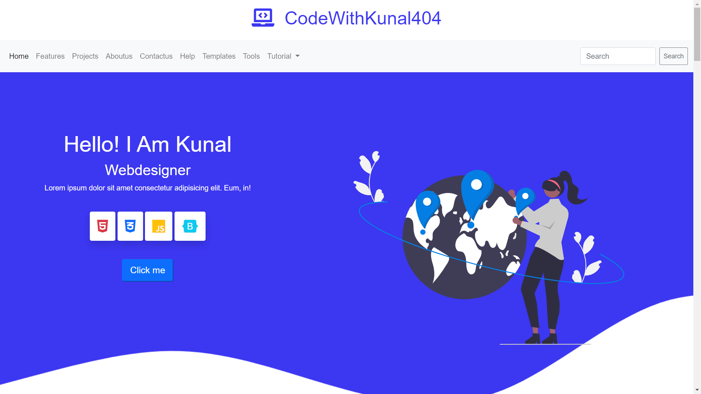

### 😎🚀 Hi I am Kunal chaudhary 

   

### Expert on 🎓

>##  Html

>## <a href="https://github.com/codewithkunal404/css-tutorial"> Css</a>

>##  Javascript

>##  Bootstrap

 

## 😎 Here are some ideas to get you started:

- 🔭 I’m currently working on live Projects...
- 🌱 I’m currently learning Webdesigning....
- 👯 I’m looking to collaborate on ...
- 🤔 I’m looking for help with......
- 💬 Ask me about ...
- 😄 Pronouns: ...
- ⚡ Fun fact: ..

# 📫 How to reach me:

### Youtube 
  

### Facebook

### Github

### Instagram

### Website

